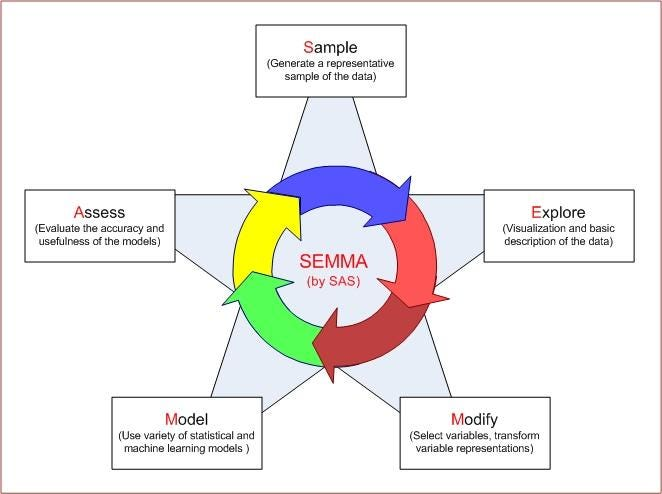

# Projeto Churn
## SEMMA
O SEMMA é uma metodologia criada pela própria SAS Institute para orientar projetos de mineração de dados (Data Mining).

- **Amostragem** *sample*:

    Esta etapa envolve a escolha de um subconjunto do conjunto de dados de volume apropriado a partir de um vasto conjunto de dados fornecido para a construção do modelo. O objetivo desta etapa inicial do processo é identificar variáveis ou fatores (dependentes e independentes) que influenciam o processo. As informações coletadas são então classificadas em categorias de preparação e validação.

- **Exploração** *explore*:

    Durante esta etapa, são realizadas análises univariadas e multivariadas para estudar as relações interconectadas entre os elementos dos dados e identificar lacunas nos dados. Enquanto a análise multivariada estuda a relação entre as variáveis, a univariada analisa cada fator individualmente para compreender sua participação no conjunto. Todos os fatores de influência que podem influenciar o resultado do estudo são analisados, com forte dependência da visualização de dados.

- **Modificação** *modify*:

    Nesta etapa, as lições aprendidas na fase de exploração a partir dos dados coletados na fase de amostragem são derivadas com a aplicação da lógica de negócios. Em outras palavras, os dados são analisados e limpos, sendo então passados para a etapa de modelagem e explorados caso necessitem de refinamento e transformação.

- **Modelo** *model*:

    Com as variáveis refinadas e os dados limpos, a etapa de modelagem aplica uma variedade de técnicas de mineração de dados para produzir um modelo projetado de como esses dados alcançam o resultado final desejado do processo.

- **Avaliar** *assess*:

    Nesta etapa final do SEMMA, o modelo é avaliado quanto à sua utilidade e confiabilidade para o tópico estudado. Os dados agora podem ser testados e usados para estimar a eficácia do seu desempenho.

## Sample

### Out of Time
Essa é uma parte não fixa da tabela, onde ela é uma parte da tebela que é separada pela(s) ultima(s) ***safra(s)***, exemplo: se for separado de 1 em 1 mês, então será usado um ou mais safras dos meses mais para frente.

E essa parte vai servir para verificar a estabilidade do modelo. Porem isso é algo mais usando quando se possui muitos dados, já que se existirem poucas amostras, essa verificação ira "roubar" parte dos dados do treinamento do modelo.

### Under e Over Samplim

#### Under Samplim:
Reduz o tamanho da classe majoritária (a que tem mais exemplos) para equilibrar com a minoritária.

Exemplo: Se você tem 10.000 transações “não fraude” e 1.000 “fraude”, pode reduzir a classe “não fraude” para 1.000 exemplos → ficando 1.000 x 1.000.

#### Over Samplim:
Aumenta o tamanho da classe minoritária (a que tem menos exemplos), replicando ou gerando novos dados.

Exemplo: Se você tem 10.000 “não fraude” e 1.000 “fraude”, pode duplicar/gerar novas amostras da classe “fraude” até chegar também em 10.000 → ficando 10.000 x 10.000.